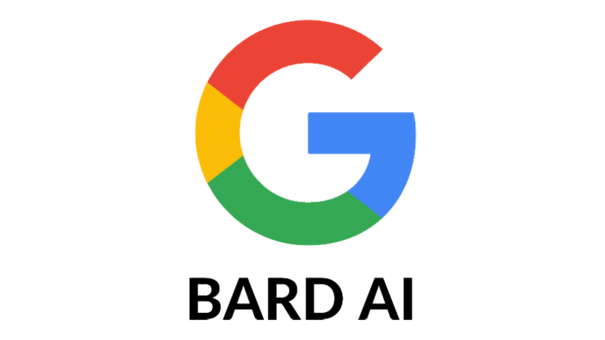

<h1>Bard-AI</img></h1><br/>

[](https://discord.gg/yAhsgskaGy)

**NOTICE:** This plugin branch is for PocketMine-MP 4. <br/>
✨ **Bard-AI is a Google Bard AI integrated chatbot plugin like ChatGPT**
</div>

# Features
- Ask a question to Google Bard
- Customizable messages
- Customizable forms
- FormUI support

# Commands & Permissions

| Command   | Description | Permission |
|-----------| ----------- | ---------- |
| `/bardai` | Ask a question to Google Bard | `bardai.command` |

# Authentication
1. Visit https://bard.google.com/
2. F12 for console
3. Session: `Application → Cookies → Copy the value of __Secure-1PSID cookie.`

# Config

```yaml
token: ''

messages:
  not-ready: '&cThe AI is not ready yet, please check token in config.yml'
  player-only: '&cThis command can only be used by players.'
  no-permission: '&cYou do not have permission to use this command.'
  empty-question: '&cYou must ask a question.'
  processing: '&aAsking Bard...'

ask-form:
  title: 'Bard AI'
  label: 'Ask Bard a question!'
  input:
    text: 'Question'
    placeholder: 'Ask a question...'

result-form:
  title: 'Bard AI'
  content: '{content}'
  button: '&cClose'
```

# Additional Notes

- If you found bugs or want to give suggestions, please visit <a href="https://github.com/Taylor-pm-pl/Bard-AI/issues">here</a> or join our Discord server.
- We accept all contributions! If you want to contribute, please make a pull request in <a href="https://github.com/Taylor-pm-pl/Bard-AI/pulls">here</a>.
 
